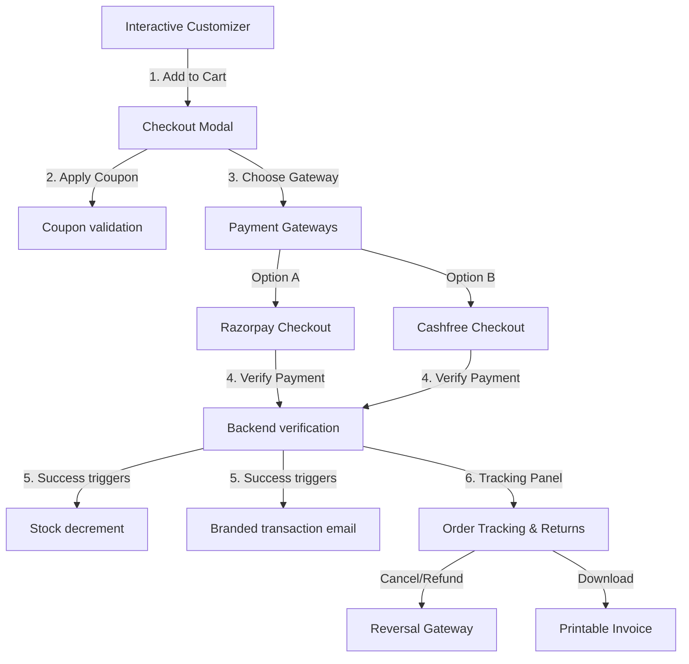

# Software Requirements Specification (SRS)
## Wings Jewellers - Technical E-Commerce & Customization Ecosystem

---

### 1. Document Control & Metadata
* **Project Name:** Wings Jewellers Integrated System
* **Version:** 1.2.0
* **Author:** Antigravity AI
* **Status:** Fully Integrated & Verified
* **Core Technology Stack:**
  * **Frontend:** React.js, Tailwind CSS, Vanilla HTML5 Canvas/SVG, Razorpay Checkout SDK, Cashfree Web Checkout
  * **Backend:** Node.js (v18+), Express.js (v4.19.2)
  * **Database:** MongoDB Atlas (Cloud Cluster Database)
  * **Authentication:** JWT (JSON Web Tokens), bcrypt.js
  * **Payment Gateways:** Razorpay (Node SDK + JS checkout) & Cashfree Payments (PG API Version `2023-08-01`)
  * **Deployment Platform:** Vercel (React Frontend UI) + Render / Railway (Express Backend APIs)

---

### 2. Executive Summary & Purpose
**Wings Jewellers** is a high-end luxury Korean jewelry platform featuring an advanced **interactive 2D/3D Design Studio** customizer. This document defines the integrated Software Requirements Specification (SRS) mapping both frontend features and backend operations carefully to support custom designs, checkout orders, dual-payment processing, client feedback loops, and operations management.

---

### 3. Integrated Feature Specifications (Frontend & Backend)

The system is engineered to manage 8 primary e-commerce dimensions:



#### 3.1 Dual Payment Gateway Hub (Razorpay & Cashfree)
* **API Endpoints:**
  - `POST /api/payment/razorpay/create` & `POST /api/payment/razorpay/verify`
  - `POST /api/payment/cashfree/create` & `POST /api/payment/cashfree/verify`
* **Razorpay Flow:** Dynamically injects `https://checkout.razorpay.com/v1/checkout.js` on customer preference, loading a sleek, customized theme-aligned checkout widget. Cryptographic validation runs backend-to-backend via HMAC SHA256 hashes.
* **Cashfree Flow:** Accesses Cashfree orders using the `2023-08-01` API parameters to fetch `payment_session_id`. Secure server-to-server validation checks if order status is `'PAID'`.
* **Mock Environment:** Supports full offline simulation fallback when credentials match test stubs (`rzp_test_...` / `cf_test_...`), letting developer test local payments easily.

#### 3.2 Reviews & Ratings Moderation
* **API Endpoints:** `GET /api/reviews/product/:productId`, `POST /api/reviews`, `PUT /api/reviews/:id/approve`
* **Aesthetic Star Selectors:** Dynamic, animated golden star inputs rating client satisfaction (1-5 stars).
* **Moderate-First Shield:** Customer feedback is held under `'isApproved: false'` status by default. Admin approval via the Operations Deck is required to publish review cards and auto-compute average product ratings.

#### 3.3 Promo Coupon System
* **Predefined Codes:** Integrated `WINGS50` (flat $50 off custom jewelry) and `WELCOME10` (10% off total checkout values).
* **Coupon Manager:** Admin panel allows on-the-fly generation of percentage-based or flat discount coupon keys.
* **Price Modifiers:** Real-time calculation and subtractive displays of promo codes on checkout summary screens before initiating order sessions.

#### 3.4 Return & Refund Management
* **Database Updates:** Tracking history logs and order payment results are shifted to `'Refunded'` status upon customer cancellation.
* **Refund Trigger:** Processing order cancellation initiates a backend gateway refund session (reversing total card transaction values) and sends a Refund Confirmation Email.
* **Lifecycle Rules:** Active cancellations are restricted to orders in `'Pending'` or `'Processing'` status. Shipped or delivered jewelry returns require offline concierge moderation.

#### 3.5 Step-by-Step Order Tracking
* **Progress Timelines:** Four-stage aesthetic timeline (Placed -> Crafting -> Shipped -> Delivered) connected to `trackingHistory` databases.
* **Status Updates:** Admin Operations Deck allows changing orders statuses with custom operational description entries (e.g. *"Our master silversmiths are casting the rose gold wing charm."*).

#### 3.6 Low Inventory Stock Alerts
* **Administrative Alerter:** Prominent warning banner at the top of the app alerting catalog admins if inventory counts drop below customizable thresholds (slider-controlled, default: 5 units).
* **Catalog Replenishment:** Simulation trigger to bulk replenish catalog items back to safe stock numbers.

#### 3.7 Branded Invoice Download
* **Print Layout:** Beautiful, clean, minimalist black-and-white grid layout designed for high-resolution tax invoice printing, omitting screen-only elements (buttons, widgets).
* **Calculations:** Generates subtotal figures, deducts applied coupon discounts, appends 3% jewelry tax calculations, and displays grand totals.

#### 3.8 Notification Email Simulator
* **Transactional Inbox:** Sliding mailbox overlay displaying branded HTML purchase confirmations and shipping status alerts on order success or cancellation.

---

### 4. Database Schema Design (Mongoose Models)

The system defines 6 core models to map the application data logically:

#### 4.1 User Model (`models/User.js`)
* Stores user credentials, active cart, and wishlist array.
* Cart customization parameters include `baseType`, `metalType`, `baseShape`, `gemstoneType`, `gemstoneCut`, `gemstoneSize`, `engravingText`, `engravingFont`, and `charms` array.

#### 4.2 Product Model (`models/Product.js`)
* Maps catalog jewelry options: `name`, `description`, `price`, `category` (ref Category), `inventory` counts, `images`, `isCustomizable` flag, and aggregated ratings metrics (`ratings.average`, `ratings.count`).

#### 4.3 Order Model (`models/Order.js`)
* Relational structure linking client `User` ID, array of `orderItems` (including custom specs), detailed `shippingAddress`, payment specifications (`paymentMethod`, `paymentResult` logs, `cashfreeOrderId`, `paymentSessionId`), tax/shipping prices, and `trackingHistory` array logs.

---

### 5. Installation, Execution & Mocks Verification

#### 5.1 Installation
1. Navigate to the backend directory:
   ```bash
   cd backend
   ```
2. Install npm packages:
   ```bash
   npm install
   ```
3. Boot the local server in hot-reloading development mode:
   ```bash
   npm run dev
   ```

#### 5.2 Mock Checking
To verify backend structural integrity, require pathways, and Mongoose controllers:
```bash
node verify_backend.js
```
*(Prints a successful integrity verification report asserting all modules load without compile errors)*
